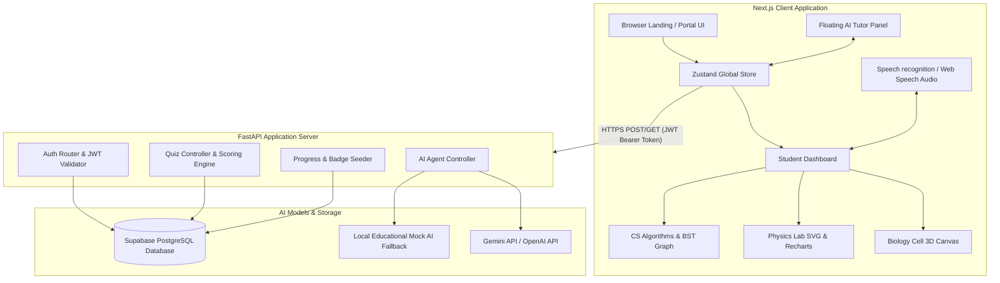

# System Architecture - AI ScienceVerse

This document explains the technical layout, data flow, and components of the **AI ScienceVerse** platform.

---

## Architecture Diagram (System Flow)

---

## Module Interactions & Control Flows

### 1. User Session & Gamification Loop
1. The user logs in via the landing screen. The backend verifies credentials using Bcrypt, generates a JWT token, and returns user details.
2. The Frontend stores the JWT token in `localStorage` and loads the student stats (XP, level, active streak) in a Zustand state store.
3. Every page renders a sticky dashboard header. Completing quizzes pushes answers to the FastAPI `/quiz/submit/{course_code}` endpoint, triggers scoring in the engine, updates database models, and gives the user level upgrades or badge achievements.

### 2. Biology 3D Rendering & Fallbacks
- Uses **React Three Fiber (R3F)** to render a 3D cell model on screen.
- When an organelle is clicked, it highlights and sends details to the explain panel.
- If the student's browser lacks WebGL capability, a fallback module detects the WebGL rendering context error and serves an interactive 2D SVG vector cell map.

### 3. Physics Simulation Loop
- Physics parameters (gravity, mass, velocity, angles) are bound to sliders.
- A high-resolution requestAnimationFrame updates trajectories/pendulums.
- Positions are mapped in real-time onto an SVG canvas to move items smoothly, and concurrently logged in a dataset rendered by a Recharts line graph.

### 4. AI Tutor Pipeline
- The student asks a question via the tutor panel.
- The backend checks for environment variables:
  - If `GEMINI_API_KEY` is present, it calls the Gemini API model.
  - If `OPENAI_API_KEY` is present, it calls the OpenAI GPT API.
  - If no keys are present, the system defaults to an offline local mock generator that uses keyword tokenization to provide instant, detailed scientific explanation fallbacks.
- The response is returned as JSON, displayed on screen, and read aloud by the browser's `SpeechSynthesis` API.
