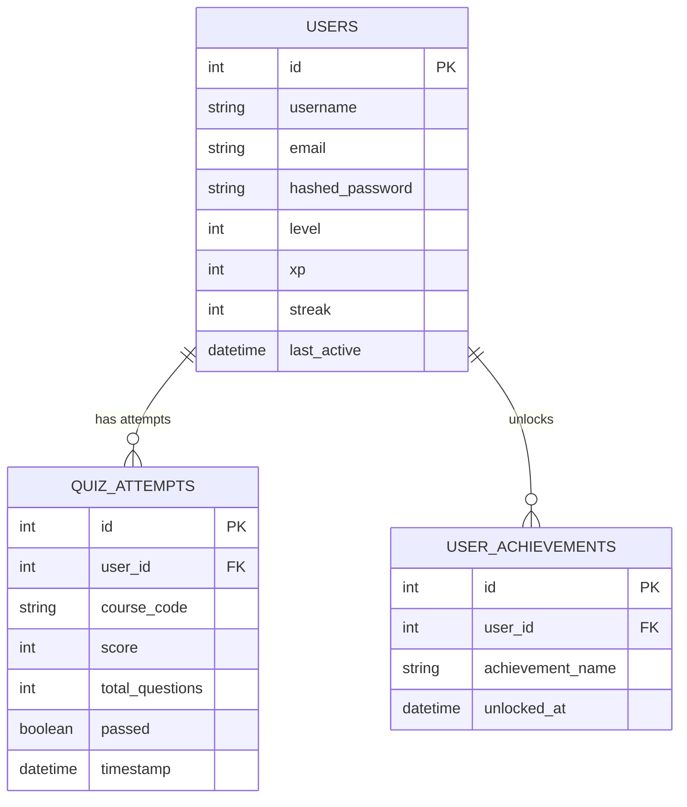

# Database Schema - AI ScienceVerse

This document specifies the database structure used in **AI ScienceVerse**. The production-ready system is designed to use **Supabase PostgreSQL** in production, and uses **SQLite** for development and local testing.

---

## ER Diagram (Mermaid Representation)

---

## Tables Description

### 1. `users` Table
Stores student registration and authentication info, gamification stats, XP, and streak telemetry.

| Column | Type | Constraints | Description |
| :--- | :--- | :--- | :--- |
| `id` | Integer | Primary Key, Auto-increment | Unique identifier for each student |
| `username` | String | Unique, Indexed, Not Null | Unique username for portal login |
| `email` | String | Unique, Indexed, Not Null | Email address |
| `hashed_password` | String | Not Null | Hashed password using bcrypt |
| `level` | Integer | Default: 1 | Current gamified level of the student |
| `xp` | Integer | Default: 0 | Total experience points accumulated |
| `streak` | Integer | Default: 0 | Consecutively active days count |
| `last_active` | DateTime | Nullable | Telemetry tracking for streak increment |

### 2. `quiz_attempts` Table
Logs student quiz grades per module, mapping areas of strength and weakness for AI analysis.

| Column | Type | Constraints | Description |
| :--- | :--- | :--- | :--- |
| `id` | Integer | Primary Key, Auto-increment | Unique attempt ID |
| `user_id` | Integer | Foreign Key -> `users.id` | Student who completed the quiz |
| `course_code` | String | Not Null | Code representing module (e.g. `cell-explorer`) |
| `score` | Integer | Not Null | Number of correct answers |
| `total_questions` | Integer | Not Null | Size of the quiz |
| `passed` | Boolean | Not Null | Flag denoting score >= 60% |
| `timestamp` | DateTime | Default: Current Timestamp | Time of grade submission |

### 3. `user_achievements` Table
Holds gamified badges (e.g. "Biology Genius", "Physics Master") unlocked by scoring >= 60% on module quizzes.

| Column | Type | Constraints | Description |
| :--- | :--- | :--- | :--- |
| `id` | Integer | Primary Key, Auto-increment | Unique badge record ID |
| `user_id` | Integer | Foreign Key -> `users.id` | Student unlocking achievement |
| `achievement_name` | String | Not Null | Name of the badge unlocked |
| `unlocked_at` | DateTime | Default: Current Timestamp | Time of achievement |

---

## Seeding & Initialization
The backend server automatically initializes schema migrations using SQLAlchemy. On startup, it checks if database content exists; if empty, it seeds:
- **Default Badges**: Biology Genius, Physics Master, Code Architect, Science Explorer.
- **Default Quizzes**: 15 multi-choice questions spanning Biology cell functions, mechanics math, and time complexity parameters.
